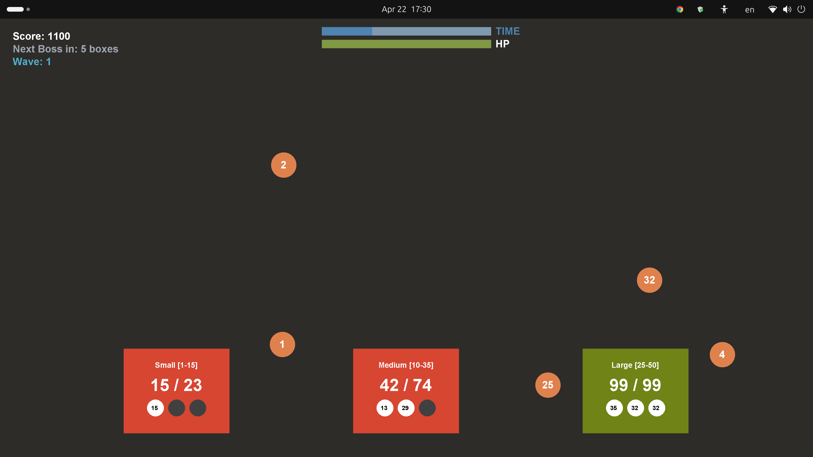
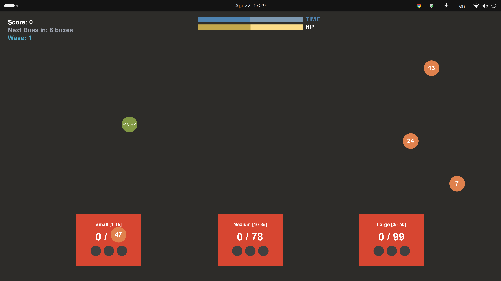
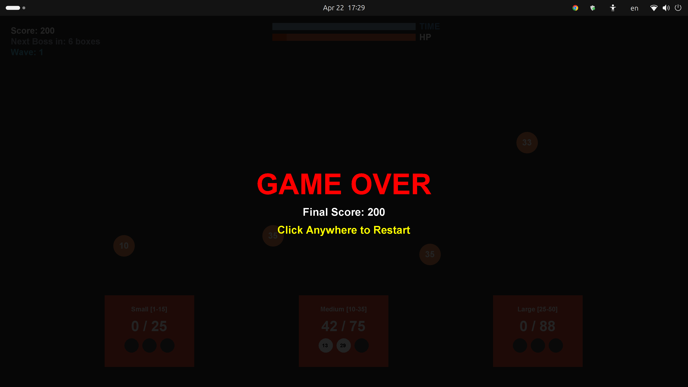

# Math Defense: The Box Sorter 🎮

> A fast-paced educational arithmetic game built in Java — drag and drop falling numbers into boxes to hit exact target sums before time runs out.


---

## 🎮 Gameplay







---

## 🌟 What Is This?

Math Defense is a fast-paced educational game designed for middle school students. Number-balls fall from the top of the screen — drag and drop them into the correct boxes to hit exact target sums. Each box has a number range and limited slots — only the right numbers fit. Solve all boxes before time runs out!

Built as a final project using **pure Java** — no external libraries or game engines.

---

## ✨ Key Features

- **Dynamic Difficulty** — target sums and number ranges scale up every wave, keeping the challenge growing
- **Boss Levels** — every 6 boxes triggers a high-stakes boss wave requiring a 10-slot mathematical decomposition
- **Look-Ahead Validation** — a custom logic engine prevents unsolvable states by calculating future moves *before* spawning numbers
- **HP Ball Powerup** — a rare green ball drops occasionally to restore 15 HP
- **Health & Time System** — real-time HP bar and countdown timer with red-flash damage feedback
- **60 FPS Game Loop** — smooth rendering using `javax.swing.Timer`

---

## 🕹️ How to Play

1. Number-balls fall from the top of the screen
2. **Drag and drop** each ball into one of the 3 boxes at the bottom
3. Each box shows its **target sum** and accepted **number range**
4. Fill all 3 slots to hit the exact target sum to solve the box ✅
5. Missing a useful ball costs you HP — reach 0 HP and it's game over!
6. Catch the rare **+15 HP** green ball to recover health
7. Survive the **Boss Wave** every 6 boxes for bonus points

---

## 🛠️ Tech Stack

| | |
|---|---|
| **Language** | Java |
| **GUI** | Java Swing / AWT (Graphics2D) |
| **Game Loop** | Custom 60FPS loop via `javax.swing.Timer` |
| **Version Control** | Git |

---

## 🚀 Getting Started

```bash
# Clone the repo
git clone https://github.com/Shafiqullah-Qaweem/Math-Defense-Java.git

# Navigate into the project
cd Math-Defense-Java

# Compile
javac MathDefense.java

# Run
java MathDefense
```

> ⚠️ Requires **Java 8 or higher**

> 💡 If the game appears small on your screen, run with:
> `java -Dsun.java2d.uiScale=2.0 MathDefense`

---

## 👥 Contributors

| Name | Role |
|------|------|
| **Shafiqullah Qaweem** | Lead Logic & Math Engine |
| **Wajih Ul Hassan Raies** | UI Design & Game Flow |

---

## 📄 License

MIT License — free to use and modify for educational purposes.
